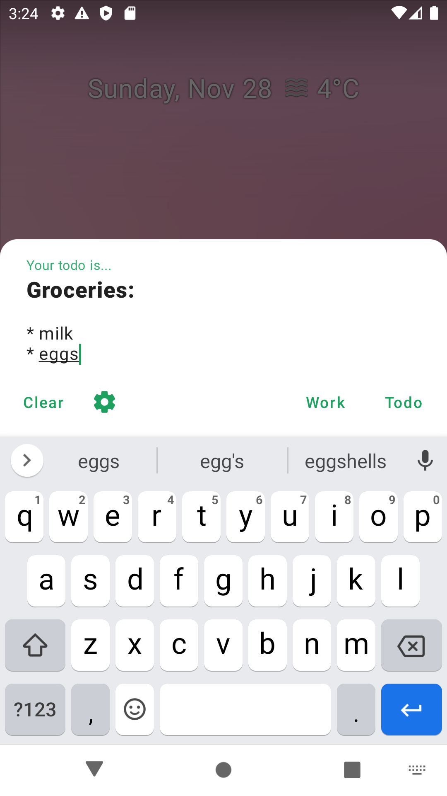

# Todomail

Single dialog application which sends emails from preconfigured emails to other preconfigured emails.
[SMTP](https://en.wikipedia.org/wiki/Simple_Mail_Transfer_Protocol) is used to configure emails.

Features:
* Lightweight dialog on top of other apps to quickly capture your todos
* Share text from other applications to your email in one click
* Share current clipboard to your email via quick settings tile (requires Android 7 and higher)

The app usages:
* Todo app
* Any other usages? If you have one feel free to share with me by 
  [creating an issue](https://github.com/nikitabobko/todomail/issues) or by sending a
  [Pull request](https://github.com/nikitabobko/todomail/pulls) to this README.md file

# Screenshots

// TODO update screenshots 

 

# But why?

There are dozens of todo apps on the market why should we have one more?

The problem of all other todo apps is that you have to have "one more" app. You have to
have "one more" place to pull your tasks from. One day you will be lazy and you will
abandon your todo app. I tried it, it doesn't work, at least for me.

The situation is different for email. You most likely already have one, you most likely
already receive important stuff on your email (so it's hard to abandon). `Todomail`
doesn't create [one more standard](https://xkcd.com/927/), it adapts one of the most
popular and flexible standard to the needs of todo.

It's convenient to have one place to pull your tasks from. Email + 
[inbox zero](https://www.google.com/search?q=inbox+zero) is perfect for it.
Among all protocols which are used for integrations by other apps and vendors email is the
most used. That's why email is the most promising protocol for organizing own
"single hub for everything".

Email is flexible and can be configured the way you want to. You can use your own email
server with your own programmed filtering rules. Or you can go with any existing email
provider and filtering features they provide.

# Install the app

* Google Play: publishing is in progress
* Download the APK from GitHub [release page](https://github.com/nikitabobko/todomail/releases)

# Tips

* The approach works best with [inbox zero](https://www.google.com/search?q=inbox+zero). Use it!
* Separate your personal todo and your work todo by using different emails.
* Use email notifications in online calendars (such as
  [Google Calendar](https://calendar.google.com/) or
  [Outlook](https://outlook.live.com/calendar)) to create recurring tasks.
* Using "email as todo" approach on desktop - [desktop/README.md](desktop)
* for Gmail:
  * Create [task-specific email addresses](https://support.google.com/a/users/answer/9308648)
    * Add your new task-specific email to your [Google contacts](https://contacts.google.com/).
      It will add the email into completion for `To:` field on web version of Gmail.
  * Use [filters](https://support.google.com/mail/answer/6579) to pre-process your 
    task-specific emails.
  * Use [Gmail snoozing feature](https://support.google.com/a/users/answer/9308663).
  * Use [Gmail multiple inboxes](https://support.google.com/mail/answer/9694882) to group
    tasks by categories. 

# The app tech stack

The app tries to use most of the modern technologies in Android development world:
* [Kotlin](https://kotlinlang.org/) programming language
* [Kotlin Coroutines](https://github.com/Kotlin/kotlinx.coroutines) - your emails are sent by
  asynchronous and non-blocking code :)
* [Jetpack Compose](https://developer.android.com/jetpack/compose) - modern, reactive UI toolkit
* [Jetpack Navigation](https://developer.android.com/guide/navigation) - easier handling of
  screen navigation
  * Note: I tried to adapt "single activity architecture" but 
    [failed](https://issuetracker.google.com/issues/200980993).
    Probably, I can do some workaround but two activities doesn't look like a big problem for me.
* [ViewModel](https://developer.android.com/topic/libraries/architecture/viewmodel) &
  [LiveData](https://developer.android.com/topic/libraries/architecture/livedata) - for
  separating UI and business logic
* And other [Jetpack Architecture Components](https://developer.android.com/jetpack) in order to
  follow [best practices](https://developer.android.com/jetpack/guide) in Android app architecture
